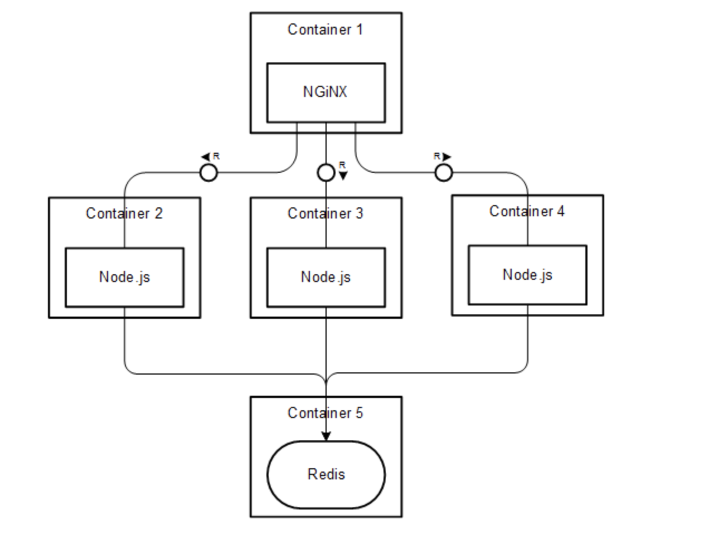

## Create docker images for the backend, frontend projects.



An example project directory :

* Create a Dockerfile for both client and server directories.


```
# Client / Server Dockerfile: 
FROM node:8

# Create app directory
WORKDIR /usr/src/app

# Install app dependencies
# A wildcard is used to ensure both package.json AND package-lock.json are copied
COPY package*.json ./

RUN npm install

# Bundle app source
COPY . .

EXPOSE 3000 #(for client) or EXPOSE 5000 #(for server)

CMD [ "npm", "start" ] 

```

* Also add a .dockerignore for both client and server

```
node_modules
npm-debug.log
```

*  Build a Docker image for both the client and server by running this command in their directories.

```
docker build -t <Name you want for your image> .  (example React:app , node:app)
```

* See the images by running the command :

```
docker images 
```
* If you want to remove an image run this:

```
docker rmi <image id>
```

* Run docker container: (Of client and server)

```
docker run -p 5000:5000 -d <image name>  (for server)
docker run -p 3000:3000 -d <image name>  (for client)

```

* Too see all running containers: 

```
docker ps
```

* To stop a container:

```
docker stop <container id>
```


* Add a docker-compose.yml file in the project directory

```
version: '2'
services:
  client:
    build: ./client
    ports:
      - '3000:3000'
    depends_on:
      - server
    stdin_open: true ## this is required to fix an issue of react and docker
  server:
    build: ./server
    ports:
      - '5000:5000'
    depends_on:
      - client
      - server
```
* Run this command in the project directory then: 

```
 docker-compose up --build -d
```
* Your docker dashboard running containers portion of your project will look like this: 

* Nginx and redis images :
 - docker-compose.yml should look like : 

 
```
version: '2'
services:
  client:
    build: ./client
    ports:
      - '3000:3000'
    depends_on:
      - server
    stdin_open: true ## this is required to fix an issue of react and docker
  server:
    build: ./server
    ports:
      - '5000:5000'
  nginx:
    image: nginx:latest
    volumes:
      - ./default.conf:/etc/nginx/conf.d/default.conf # Mapping my conf to default nginx config
    ports:
      - '443:443'
    depends_on:
      - client
      - server
  redis-server:
    image: 'redis'

```

* Also add a default.conf in the project directory :

```
upstream nodes {
                #Changing from default(Round robin) to least connection to redirect requests to both servers
                #least_conn;
                ip_hash;
                server server:5000;
                server server:5001;
    }
    server {
        listen 443 ssl;
        #charset koi8-r;
        #access_log  logs/host.access.log  main;
        ssl_certificate /etc/nginx/server.crt;
        ssl_certificate_key /etc/nginx/server.key;
        
        location / {
            proxy_set_header   X-Forwarded-For $remote_addr;
            proxy_set_header   Host $http_host;
            proxy_pass  http://client:3000;
                # enable WebSockets
            proxy_http_version 1.1;
            proxy_set_header Upgrade $http_upgrade;
            proxy_set_header Connection "upgrade";
        }
        location /node/ {
            rewrite ^/node/(.*) /$1 break;
            proxy_pass http://nodes;
            # enable WebSockets
            proxy_http_version 1.1;
            proxy_set_header Upgrade $http_upgrade;
            proxy_set_header Connection "upgrade";
            proxy_set_header Host $host;
        }
         location /socket.io/{
          proxy_pass "http://nodes/socket.io/";
          proxy_http_version 1.1;
          proxy_set_header Upgrade $http_upgrade;
          proxy_set_header Connection "upgrade";
          proxy_set_header Host $host;
        }
        include servers/*;
    }

```

* Then run this command in the project directory:

```
 docker-compose up --build -d
```
* Now your nginx and redis containers are running!

* Create a self-signed SSL certificate. Configure your nginx to work with that certificate and allow only SSL connections. ?

```
https://qiita.com/osk_kamui/items/04778addd1cebb54e2d8
```
Follow the directions of the above link to the letter and you are done!

Your docker desktop will look like :


 