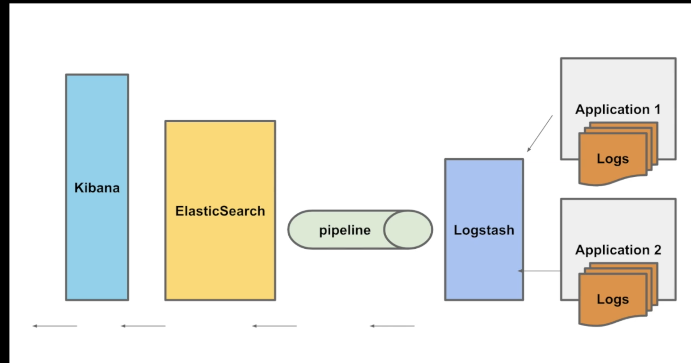

# ELK



Logstash ---> Elastic ---> Kibana

Start all the three servers

Go their respective folders and

1. bin/elasticsearch
2. bin/logstash -f logstash.conf
3. bin/kibana

#### Logstash

Just give your directory to the logs you want to be searched. It is dynamic, works on any new logs that is generated in the file.

Sample config

```
input { 
	file{
		type =>"log"
		path =>"/Users/yatingupta/Github/digitalkyc-prototype/logs/info.log"
	}
 }
output {

  elasticsearch { 
  hosts => ["localhost:9200"]
  index => "kyc" 
  }
  stdout { codec => rubydebug }
}

```

#### Elastic Search

after logstash, check 9200:/_cat/_indices to see if your new index made in logstash appeared.

Syntax to use in Nodejs

```
const elasticsearch = require('elasticsearch');

const client = new elasticsearch.Client({
  host: 'localhost:9200',
  log: 'trace',
  apiVersion: '7.2', // use the same version of your Elasticsearch instance
});


  try {
    const response = await client.search({
      index: 'kyc*',
      type: '_doc',
      body: {
        query: {
          match: {
            message: id.id,
          },
        },
      },
    });
    
```   
    
#### Kibana

Visualization for your elastic data.

If any part of elk is giving server error, elastic search might be in read only mode. Fix -- [Link](https://stackoverflow.com/questions/50609417/elasticsearch-error-cluster-block-exception-forbidden-12-index-read-only-all)