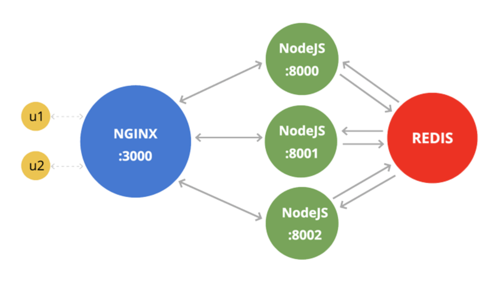
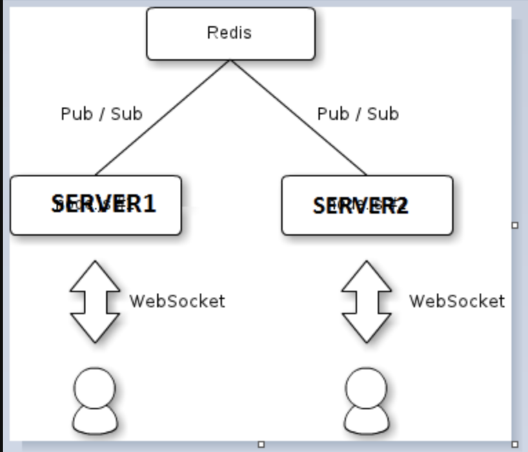

# Nginx



* Nginx is used to run servers ( React / multiple nodejs etc) on same port but different endpoints. It maps the servers to a port and you can provide endpoints like /nodejs etc 
* It can be used to do load balancing 
* To work, install nginx and edit config file. 

Commands

```
nginx // Running nginx
nano /usr/local/etc/nginx/nginx.conf // Editing config file
nginx -s reload  // Reloading nginx 
lsof -nPL -iTCP:8080 // See process running ( if need to kill nginx )
kill -9 {PID}

```

#### Setting up react and a node js server

Edit your config file


Add these two locations under server

```
Map your react port 
location / {

            proxy_set_header   X-Forwarded-For $remote_addr;
            proxy_set_header   Host $http_host;
            proxy_pass  http://localhost:3000; 

                # enable WebSockets
            proxy_http_version 1.1;
            proxy_set_header Upgrade $http_upgrade;
            proxy_set_header Connection "upgrade";

        }
        
Map your nodejs port
        
location /nodejs {
            rewrite ^/nodejs/(.*) /$1 break;
            proxy_pass http://localhost:5000;

            # enable WebSockets
            proxy_http_version 1.1;
            proxy_set_header Upgrade $http_upgrade;
            proxy_set_header Connection "upgrade";
            proxy_set_header Host $host;
        }
```
Use Api like : http://127.0.0.1:8080/nodejs/api/user

#### Load balancing

For load balancing different nodejs servers should be running on different ports

First set up the nodejs instances as upstream {variable_name}
 
* Modes for routing can be defined. Default is round robin
* least_conn send request to server with least req 
* ip_hash hashes ip to redirect reqs.

```
 upstream nodes {
                #Changing from default(Round robin) to least connection to redirect requests to both servers
                #least_conn;
                ip_hash;
                server 127.0.0.1:5000;
                server 127.0.0.1:5001;
    }
```
Then set the end point as 

```
location /nodejs/ {
            rewrite ^/nodejs/(.*) /$1 break;
            proxy_pass http://nodes;

            # enable WebSockets
            proxy_http_version 1.1;
            proxy_set_header Upgrade $http_upgrade;
            proxy_set_header Connection "upgrade";
            proxy_set_header Host $host;
        }
```


### Setting up socket.io on nginx

* socket.io needs to be at separate end point which is /socket.io

##### Process ( assuming nginx is at 8080 running nodejs instances at /nodejs and react at / )
* Client side : ENDPOINT = 'localhost:8080';
* In nginx config 

```
location /socket.io/{
          proxy_pass "http://nodes/socket.io/";
          proxy_http_version 1.1;
          proxy_set_header Upgrade $http_upgrade;
          proxy_set_header Connection "upgrade";
          proxy_set_header Host $host;
        }
```
(http://nodes is upstream name of nodejs servers)

* Server will continue to listen to its own port 

#### Entire server of config for reference

```
events {
    worker_connections  1024;
}

http {
    include       mime.types;
    default_type  application/octet-stream;

    #log_format  main  '$remote_addr - $remote_user [$time_local] "$request" '
    #                  '$status $body_bytes_sent "$http_referer" '
    #                  '"$http_user_agent" "$http_x_forwarded_for"';

    #access_log  logs/access.log  main;

    sendfile        on;
    #tcp_nopush     on;

    #keepalive_timeout  0;
    keepalive_timeout  65;

    #gzip  on;

    upstream nodes {
                #Changing from default(Round robin) to least connection to redirect requests to both servers
                #least_conn;
                ip_hash;
                server 127.0.0.1:5000;
                server 127.0.0.1:5001;
    }

    server {
        listen       8080;
        #charset koi8-r;

        #access_log  logs/host.access.log  main;

        location / {

            proxy_set_header   X-Forwarded-For $remote_addr;
            proxy_set_header   Host $http_host;
            proxy_pass  http://localhost:3000;

                # enable WebSockets
            proxy_http_version 1.1;
            proxy_set_header Upgrade $http_upgrade;
            proxy_set_header Connection "upgrade";

        }

        location /nodejs/ {
            rewrite ^/nodejs/(.*) /$1 break;
            proxy_pass http://nodes;

            # enable WebSockets
            proxy_http_version 1.1;
            proxy_set_header Upgrade $http_upgrade;
            proxy_set_header Connection "upgrade";
            proxy_set_header Host $host;
        }

         location /socket.io/{
          proxy_pass "http://nodes/socket.io/";
          proxy_http_version 1.1;
          proxy_set_header Upgrade $http_upgrade;
          proxy_set_header Connection "upgrade";
          proxy_set_header Host $host;
        }

        include servers/*;

    }


```        

# Redis



* Connecting to redis
* Redis server should be running

```
const redis = require('redis');
// Create Redis Client
let client = redis.createClient();
let publisher = redis.createClient();
let subscriber = redis.createClient();

```
* Pub-Sub Model

	* Everything sent to publish/on receiving/setting/getting should be in valid format
	* If Json needs to be sent stringify it.
	* On receiving Json.parse it.

```
publisher.publish('user-typing', name);
subscriber.subscribe('user-typing');
```
* Setting and getting on redis database

```
client.set('users', JSON.stringify(users));

client.get('users', function (err, reply) {

      // reply is null when the key is missing
      });
    });

```
Receiving data on Redis subscription

```
// This has to be outside socket connection otherwise all connection even inactive ones start publishing and multiple requests gets received

subscriber.on('message', (channel, message) => {
  console.log('Received data :' + message);
  //to add on other server's people
  io.emit('notification', {});
});

```
        
# Ngrok

Commands

```
ngrok http 8080 // this runs ngrok at port 8080
```        
* After setting up ngrok, change all references from localhost to new link. ( In api calls and socket )
        
#### Most helpful resources :

1. https://gist.github.com/soheilhy/8b94347ff8336d971ad0        
2. https://docs.nginx.com/nginx/admin-guide/load-balancer/http-load-balancer/
3. https://dev.to/ganeshmani/implementing-redis-pub-sub-in-node-js-application-12he
4. https://www.npmjs.com/package/redis
        
        
                        
        