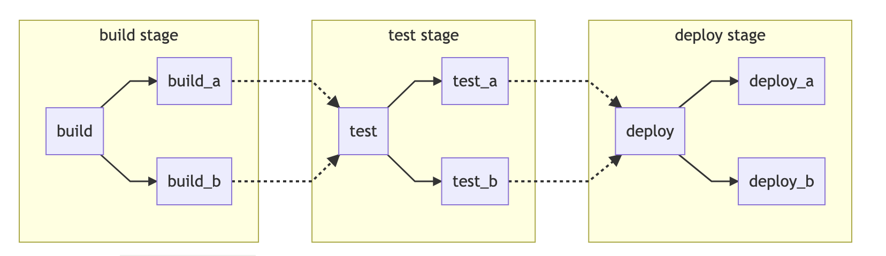

## Making a gitlab CI/CD pipeline



#### Linting a code

* Make a file .gitlab-ci.yml
* Below code performs eslint on server and client side of application. 
* It has one stage "lint" with 2 scripts "ServerEslint" and "ClientEslint"
* Steps followed , enter the folder install required modules and run the lint command. ( Described in package.json)
* Eslint config files are defined separately in each.

.gitlab-ci.yml

```
image: node

stages:
  - lint

ServerEslint:
  stage: lint
  script:
    # Install eslint
    - cd server
    - npm install
    # Run eslint
    - npm run lint

ClientEslint:
  stage: lint
  script:
    # Install eslint
    - cd client
    - npm install
    # Run eslint
    - npm run lint
```

.eslintrc -- Server

```

{
  "env": {
    "commonjs": true,
    "es6": true,
    "node": true
  },
  "extends": ["airbnb-base"],
  "globals": {
    "Atomics": "readonly",
    "SharedArrayBuffer": "readonly"
  },
  "parserOptions": {
    "ecmaVersion": 11
  },
  "rules": {}
}

```

.eslintrc -- Client

[Reference](https://medium.com/@pppped/extend-create-react-app-with-airbnbs-eslint-config-prettier-flow-and-react-testing-library-96627e9a9672)

```
{
  "extends": [
    "react-app",
    "airbnb",
    "plugin:jsx-a11y/recommended",
    "prettier",
    "prettier/react"
  ],
  "plugins": ["jsx-a11y", "prettier"],
  "rules": {
    "react/jsx-filename-extension": [1, { "extensions": [".js", ".jsx"] }]
  }
}
```
