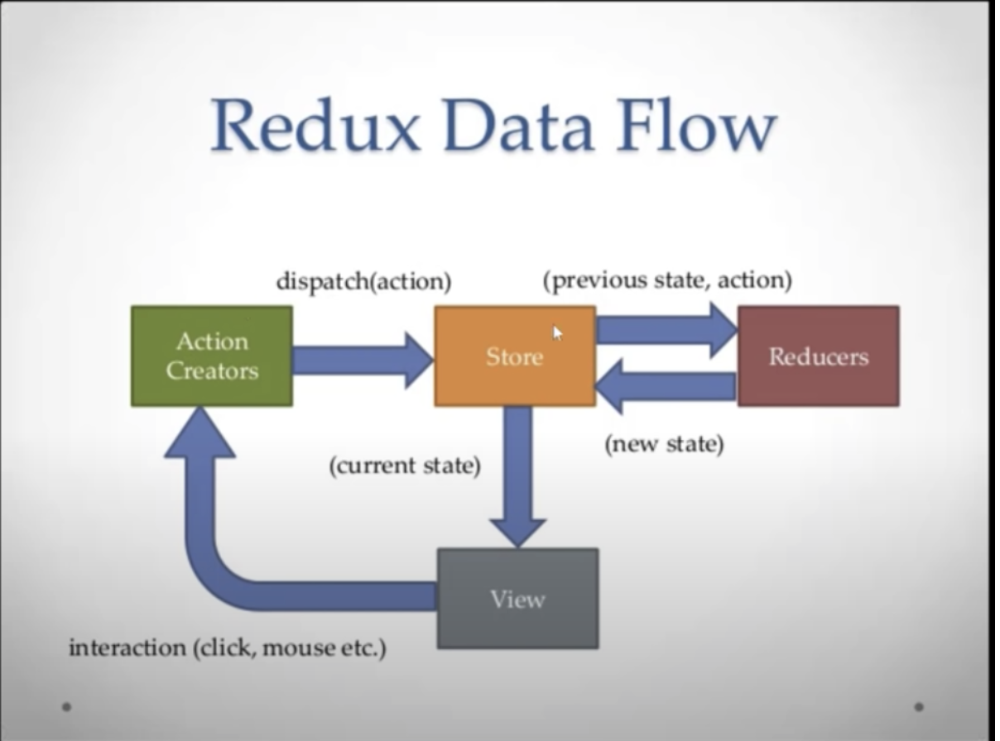
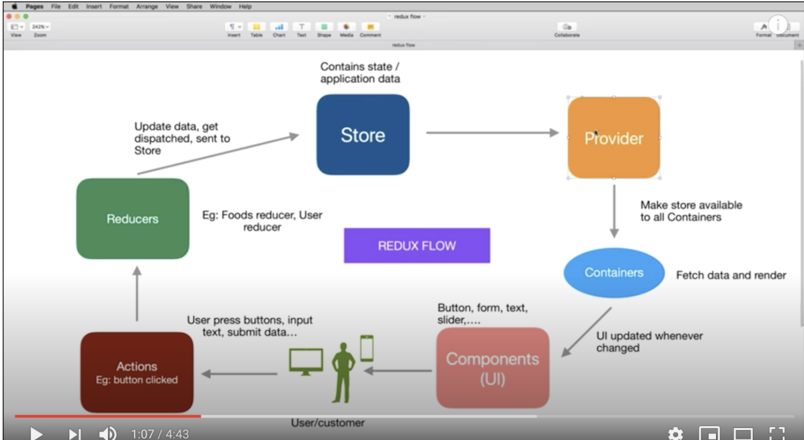
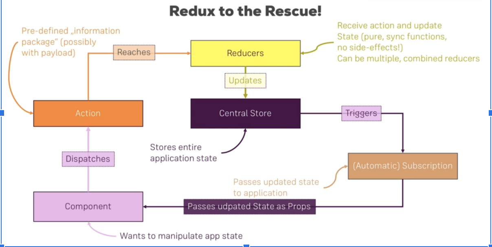
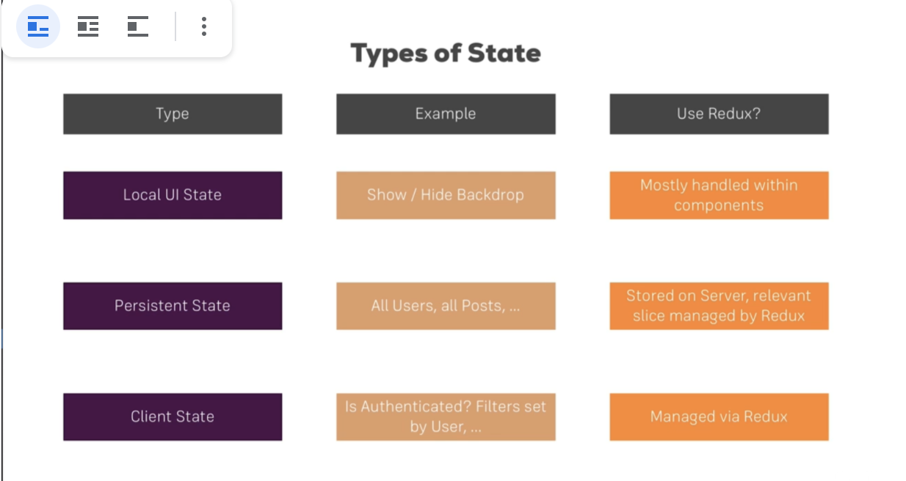

# React 

#### React some points : 
* Index.js is the entry point to react
* Everything runs through one single physical page (index.html)
* (Main parent App component wraps around everything)
* Render() method is called the lifecycle method and it’s the only one required to render the component in the browser.
* Prop: property


## State :
In the React sense, “state” is an object that represents the parts of the app that can change.

Each component can maintain its own state, which lives in an object called this.state.


## Actions

Actions are plain JavaScript objects. Actions must have a type property that indicates the type of action being performed. Types should typically be defined as string constants. Once your app is large enough, you may want to move them into a separate module.

## Redux 
Creates application state. ( in react we have component state)

Main purpose : creates state you can send to all components

<Provider> we cover <App> with this, since Provider is a helper component that injects store into react components






## Reducers

Reducers specify how the application's state changes in response to actions sent to the store. Remember that actions only describe what happened, but don't describe how the application's state changes

The reducer is a pure function that takes the previous state and an action, and returns the next state.


```
(previousState, action) => nextState
```

## Component
Simply put, a component is a JavaScript class or function that optionally accepts inputs i.e. properties(props) and returns a React element that describes how a section of the UI (User Interface) should appear

## Hooks

Hooks are functions that let you “hook into” React state and lifecycle features from function components

## Fragments

React rendering required a div element to cover all the HTML. So if a function is used inside another function an extraneous div may ruin the HTML. Thus fragment were introduced

## Redux 

It is a javascript library for managing the application state.

As you can see in the diagram the App dispatches an action and the action is handled by the reducer  incorporating the changes in the current state and saving the final state in the store.

## Props vs states
### Props 

* arguments to functions (component)
* Must be updated outside component

### State 

* inside the component
* Must be updated inside component

## Storage

### Short-term state
I think of short-term data as data that will likely change rapidly—data that may represent only part of an atomic change to the state. At the simplest level, this includes the characters present in a text field as the user types. I would also extend this to include data in an entire form; this data can be considered a work in progress until the form is submitted.

I like to store this type of data in local React state. I would even include things like how to filter a list of items, and whether or not to show or hide completed items in a to-do app—assuming it is not tied to user preferences.

### Medium-term state
By medium-term state, I mean state that will stick around while the user navigates your app. This could be data loaded from an API, or any changes that you want to be persisted up until a page refresh. After submitting a form, I would store the state in the Redux store. As an example, if a user submits a form updating their profile information, it would make sense to store this in Redux.

### Long-term state
This is state that should be persisted between refreshes of the page or between separate visits to the page. Since the Redux store will be created anew when refreshing, this type of data should be stored somewhere else—likely to a database on a server or into local storage in the browser.
Functional components vs class components

If you need a state in your component you will either need to create a class component or you lift the state up to the parent component and pass it down the functional component via props.


