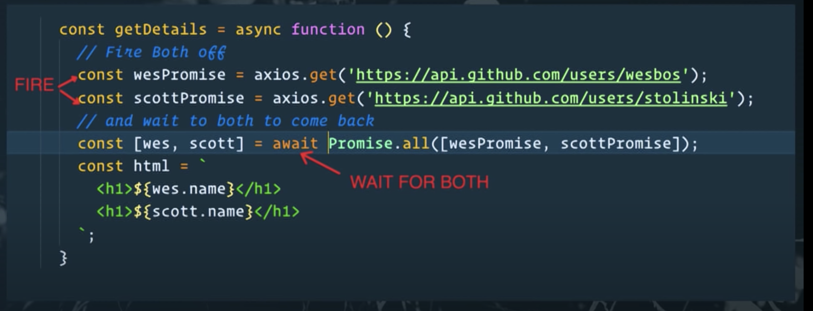
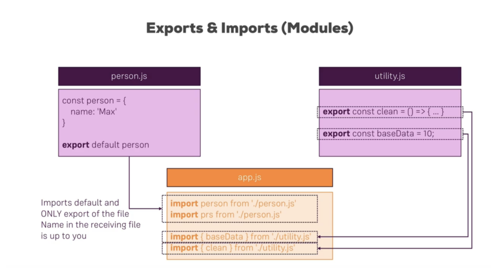

## == vs ===

```
The === operator is called a strict comparison operator, it does differ from the == operator.
Lets take 2 vars a and b.
For "a == b" to evaluate to true a and b need to be the same value.
In the case of "a === b" a and b must be the same value and also the same type for it to evaluate to true.
```

## =>
Arrow functions allow us to write shorter function syntax:

```
Before:
hello = function() {
  return "Hello World!";
}
With Arrow Function:
hello = () => {
  return "Hello World!";
}
```
In fact, if you have only one parameter, you can skip the parentheses as well.

Arrow Function Without Parentheses:

```
hello = val => "Hello " + val

```
 
## Getting ID of specific object in an array
### ( Map vs filter vs for loop )

The map method is used to convert each item of an array, while the filter method is used to select certain items of an array.

Eg : Getting Id of Like which is to removed from post

Correct way 

```
// post.likes gives you an array of likes of the post.

(like=> like.user.toString()) is equivalent to 
function(like){
	Return like.user.toString();
}

const removeIndex = post.likes
      .map(like => like.user.toString())
      .indexOf(req.user.id);


// so basically map gives you the id and filter will give you the object.
```

while

```
const removeIndex = post.likes.filter(like => like.user.toString() === req.user.id)

Will return [ { _id: 5edf6385b36ede714de8d12d, user: 5ede49820f7b82578db80879 } ] 
```

Doing the same thing with for loop

```
for (let i = 0; i < post.likes.length; i++) {
     if (post.likes[i].user.toString() === req.user.id)
       console.log("For loop index :" + i)
   }
```

Although both for loop and map solves the problem, map is preferable because

```
In the same way that the code inside of our for loop is called as long as the condition is true, the code inside of map() is called one time for each element in the array.
This does the same thing as our for loop, but the big difference is that the conditions for iteration are handled for us.
```
## Const

Variables defined with const behave like let variables, except they cannot be reassigned:

Const cannot be reassigned
```
const PI = 3.141592653589793;
PI = 3.14;      // This will give an error
PI = PI + 10;   // This will also give an error
```

But their properties can change !

You can change the properties of a constant object:

```
// You can create a const object:
const car = {type:"Fiat", model:"500", color:"white"};
// You can change a property:
car.color = "red";
// You can add a property:
car.owner = "Johnson";
```
 
But you can NOT reassign a constant object:

```
const car = {type:"Fiat", model:"500", color:"white"};
car = {type:"Volvo", model:"EX60", color:"red"};    // ERROR
```

## Async, Sync 

* Node.js is a single threaded language which in background uses multiple threads to execute asynchronous code.
* Node.js is non-blocking which means that all functions ( callbacks ) are delegated to the event loop and they are ( or can be ) executed by different threads. That is handled by Node.js run-time.

### Async + Await != Sync

* Your async code block is waiting for the await call to return to continue, however the rest of your application isn't waiting and can still continue like normal.
* In contrast, a synchronous call would make your entire application or thread wait until the code finished executing to continue on with anything else.
Callbacks
* More complexly put: In JavaScript, functions are objects. Because of this, functions can take functions as arguments, and can be returned by other functions. Functions that do this are called higher-order functions. Any function that is passed as an argument is called a callback function.
* Why do we need Callbacks?
For one very important reason — JavaScript is an event driven language. This means that instead of waiting for a response before moving on, JavaScript will keep executing while listening for other event
* Callbacks are a way to make sure certain code doesn’t execute until other code has already finished execution.

``` 
function doHomework(subject, callback) {
  alert(`Starting my ${subject} homework.`);
  callback();
}
function alertFinished(){
  alert('Finished my homework');
}
doHomework('math', alertFinished);
```

We’ve passed the alertFinished function definition as an argument during our doHomework() function call!

```
output : starting followed by finished. 
```

The main difference between callbacks and promises is that with callbacks you tell the executing function what to do when the asynchronous task completes, whereas with promises the executing function returns a special object to you (the promise) and then you tell the promise what to do when the asynchronous task completes.


[Reference](https://gosink.in/common-javascript-promise-mistakes-beginners/)

### Using promise.all() saves time

Change this 

```
const { promisify } = require('util');
const sleep = promisify(setTimeout);

async function f1() {
  await sleep(1000);
}

async function f2() {
  await sleep(2000);
}

async function f3() {
  await sleep(3000);
}

// Running code sequentially
(async () => {
  console.time('sequential');
  await f1();
  await f2();
  await f3();
  console.timeEnd('sequential'); // Approx 6 seconds
})();
```
to

```
(async () => {
  console.time('concurrent');
  await Promise.all([f1(), f2(), f3()]);
  console.timeEnd('concurrent'); // Approx 3 seconds
})();
```
Also 



## Spread Operator

When ...arr is used in the function call, it ‘expands’ an iterable object arr into the list of arguments

```
// spread operator doing the concat job
let arr = [1,2,3];
let arr2 = [4,5];
  
arr = [...arr,...arr2];
console.log(arr); // [ 1, 2, 3, 4, 5 ]
```

## Export & Import


## Super
By calling the super() method in the constructor method, we call the parent's constructor method and gets access to the parent's properties and methods:

## Callbacks

* More complexly put: In JavaScript, functions are objects. Because of this, functions can take functions as arguments, and can be returned by other functions. Functions that do this are called higher-order functions. Any function that is passed as an argument is called a callback function.

#### Why do we need Callbacks?
For one very important reason — JavaScript is an event driven language. This means that instead of waiting for a response before moving on, JavaScript will keep executing while listening for other event

- Callbacks are a way to make sure certain code doesn’t execute until other code has already finished execution.

```
function doHomework(subject, callback) {
  alert(`Starting my ${subject} homework.`);
  callback();
}
function alertFinished(){
  alert('Finished my homework');
}
doHomework('math', alertFinished);
```
We’ve passed the alertFinished function definition as an argument during our doHomework() function call!

output : starting followed by finished. 

The main difference between callbacks and promises is that with callbacks you tell the executing function what to do when the asynchronous task completes, whereas with promises the executing function returns a special object to you (the promise) and then you tell the promise what to do when the asynchronous task completes.

### References :

1. https://codeburst.io/javascript-what-the-heck-is-a-callback-aba4da2deced
2. https://stackoverflow.com/questions/38425751/returning-chrome-storage-api-value-without-function
3. https://itnext.io/javascript-promises-vs-rxjs-observables-de5309583ca2

